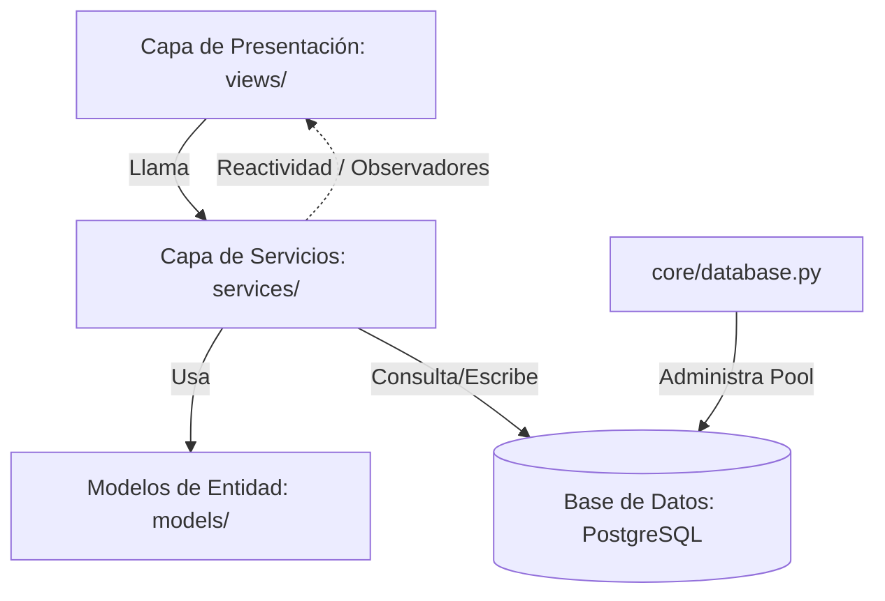

# Guía de Arquitectura y Funcionamiento - Godonto

Este directorio `.agent/` contiene documentación detallada y guías de desarrollo diseñadas para que cualquier agente de IA o desarrollador comprenda el funcionamiento del sistema **Godonto** y pueda realizar mejoras sin introducir regresiones o romper flujos existentes.

---

## 1. Resumen de la Arquitectura del Sistema
El proyecto sigue una arquitectura **multicapa (Layered Architecture)**, separando de manera estricta las responsabilidades de la UI, la lógica de negocio y el acceso a los datos.



1. **Presentación (Views - `/views`):** Desarrollada con **Flet** (Framework de UI basado en Flutter para Python). Maneja exclusivamente controles de interfaz y responde a eventos del usuario.
2. **Servicios (Services - `/services`):** Contiene la lógica de negocio. Realiza validaciones, maneja deudas, amortizaciones de pagos, y coordina acciones de base de datos.
3. **Modelos (Models - `/models`):** Contiene clases de Python simples (Dataclasses o Clases) que representan entidades de base de datos (e.g., `Client`, `Appointment`, `Payment`, `Quote`).
4. **Infraestructura y Núcleo (Core - `/core`):** Administra la configuración (`config.py`) y el pool de conexiones de base de datos (`database.py`).

---

## 2. Puntos Clave de Funcionamiento

### A. Patrón Observador (Reactividad en UI)
Para evitar que las vistas queden desincronizadas con la base de datos, el proyecto implementa un sistema reactivo sencillo en `/services/observable.py`:
- Los servicios heredan o tienen un mecanismo observable.
- Las vistas principales (como `ClientsView`) se suscriben a eventos en su constructor:
  ```python
  self.client_service.subscribe(self)
  ```
- Al ocurrir cambios en la base de datos (e.g., creación, edición o eliminación de un cliente), el servicio emite un evento como `'CLIENT_CREATED'` o `'CLIENT_UPDATED'`.
- La vista recibe el evento mediante su método `on_event(self, event_type, data)` y recarga automáticamente su contenido llamando a `update()`.

### B. Gestión Financiera (Pagos, Créditos y Deudas)
La lógica del servicio de pagos (`PaymentService` en `/services/payment_service.py`) es transaccional y robusta:
- **create_payment():** Registra un pago. A continuación, obtiene las deudas del cliente ordenadas por fecha de vencimiento (`due_date ASC`) y va aplicando el pago de forma progresiva a cada deuda pendiente.
- **Crédito a Favor (`client_credits`):** Si tras cubrir todas las deudas del cliente sobra dinero del pago registrado, este excedente se guarda automáticamente como "saldo a favor".
- **create_debt():** Al registrar una deuda, el sistema primero verifica si el cliente tiene saldo a favor y, si lo tiene, amortiza total o parcialmente la deuda utilizando dicho crédito de forma automática.

### C. Tratamientos del Historial Médico (`HistoryService`)
Los tratamientos provienen principalmente de presupuestos aprobados (`quotes` y `quote_treatments`).
- **Vista Unificada:** `HistoryService.get_suggested_and_completed_treatments` unifica los tratamientos pendientes sugeridos y los que ya fueron completados (guardados en `client_treatments`), facilitando su administración.
- **Flujo de Pago y Compleción:** Al registrar un pago desde la lista de clientes, el administrador puede opcionalmente marcar qué tratamientos pendientes han sido realizados. Tras una transacción exitosa de pago, el sistema invoca `HistoryService.add_client_treatment` para actualizar secuencialmente las cantidades completadas en el historial.

---

## 3. Buenas Prácticas y Errores Comunes (Pitfalls) a Evitar

### ⚠️ Limitaciones de Parámetros de Diseño en Flet
Un error común al estructurar la interfaz con Flet es asumir que los contenedores como `ft.Column`, `ft.Row` o incluso `ft.Container` aceptan propiedades de tamaño máximo (`max_height` o `max_width`) directamente en sus constructores en la versión instalada de Flet.
- **Uso de `height` y `width`:** Para forzar límites de tamaño y habilitar scroll en columnas (`ft.Column`), debe utilizarse el atributo `height` en su constructor, combinándolo con la propiedad `scroll=ft.ScrollMode.AUTO`.
  ```python
  # CORRECTO:
  treatments_list_container = ft.Column(
      controls=treatment_checkboxes,
      scroll=ft.ScrollMode.AUTO,
      height=180,
      spacing=5
  )
  ```
- **Limpieza de Overlays en Rutas:** Al cambiar de página en `main.py`, la aplicación limpia el overlay global (`page.overlay.clear()`). Al implementar DatePickers u otros controles de diálogo que se inyectan en el overlay de la página, asegúrate de recrearlos adecuadamente al cargar la vista para evitar referencias muertas o elementos huérfanos.

### ⚠️ Manejo Transaccional en Base de Datos
- Las operaciones complejas que modifican múltiples tablas (como `update_payment` o `delete_payment`) usan de manera explícita bloques de control transaccional de SQL (`BEGIN;`, `COMMIT;`, `ROLLBACK;`) dentro del mismo cursor.
- Si se inyecta un cursor externo en llamadas secuenciales (e.g., `add_client_treatment(..., cursor=cursor)`), se debe mantener el contexto abierto y delegar el `COMMIT` o `ROLLBACK` al método padre. No cierres el cursor o la conexión prematuramente.

### ⚠️ Rutas y Navegación Dinámica (`main.py`)
- Las vistas dinámicas parsean los parámetros de la URL directamente en el enrutador síncrono `route_change` (e.g., `/clients/<id>/history`).
- Si modificas el nombre de una ruta o los parámetros que recibe, asegúrate de actualizar el enrutador en `main.py` y todas las llamadas a `page.go()` en las vistas de origen.

---

## 4. Registro de Cambios Recientes
- **Modal de Pagos con Tratamientos (Mayo 2026):** Se integró `HistoryService` en la opción "Registrar Pago" del menú de clientes para poder marcar tratamientos pendientes directamente durante la transacción financiera de abono.
